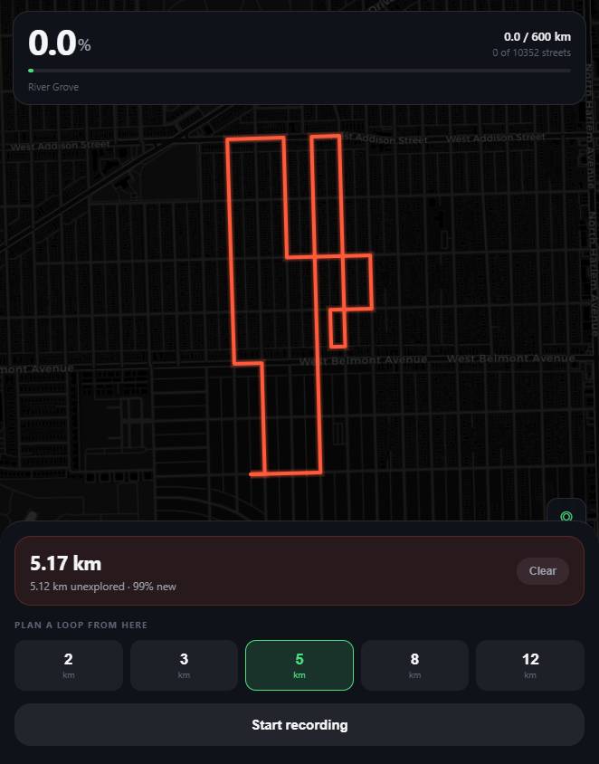

# Street Explorer

**[Live demo](https://aidanvalero.github.io/street-explorer/)**



Tracks which streets you have actually run, and plans a loop that covers new ones.

Pick a starting point and a distance, and it returns a closed circuit of roughly
that length weighted toward streets you have not covered yet. Recording a run
matches your GPS trace back onto the street graph and marks what you really
walked, so the map fills in over time.

Built around the ~10,000 streets covering River Grove and Chicago's northwest
side. The street graph ships inside the page, so it only knows that region.

## The routing

Planning the loop is an orienteering problem: maximize new streets covered,
subject to a distance budget, ending where you started. That is NP-hard, so
`planRoute` is a greedy heuristic. The constraint that makes it work is
feasibility of the return trip.

```js
const home = dijkstra(reg, src);   // cost from every node back to the start

// ... each iteration, from the current node:
const from = dijkstra(reg, cur, rem);            // bounded by remaining budget

for (const e of uncoveredEdges) {
  const ap = from.dist[near];                    // cost to reach the edge
  const bk = home.dist[far];                     // cost home from its far end
  if (dist + ap + len + bk > budget * 1.05) continue;
  if (ap < pc) { pc = ap; pick = e; }            // nearest reachable new street
}
```

Distance-to-home is computed once up front, which makes the "can I still get
back?" test an array lookup instead of a search. Every candidate edge is checked
in both orientations, and one is only taken if the walk so far, the approach,
the edge itself, and the trip home all still fit the budget. Without that check
a greedy walker happily strands itself four kilometres out with one kilometre of
budget left.

The 5% slack is deliberate. Requiring an exact fit rejects good edges near the
end of the budget and produces short, timid loops.

Per-iteration Dijkstra uses a `cutoff` equal to the remaining budget so the
search never expands the whole graph.

## Coverage matching

`matchCoverage` decides which streets a recorded trace actually covered. A
street counts when at least 60% of its vertices fall within 22 m of the trace.
Trace segments longer than 300 units are skipped, which throws out GPS
teleports rather than letting one bad fix paint a whole neighbourhood as walked.

## Built with

[MapLibre GL](https://maplibre.org/) for rendering, `polygon-clipping` for the
fog-of-war veil, and plain browser APIs for everything else. No build step. It
is a single self-contained `index.html`, which is convenient to deploy and
genuinely unpleasant to read.

## Running it

Open `index.html`, or serve the directory. Geolocation needs `https://` or
`localhost`.
